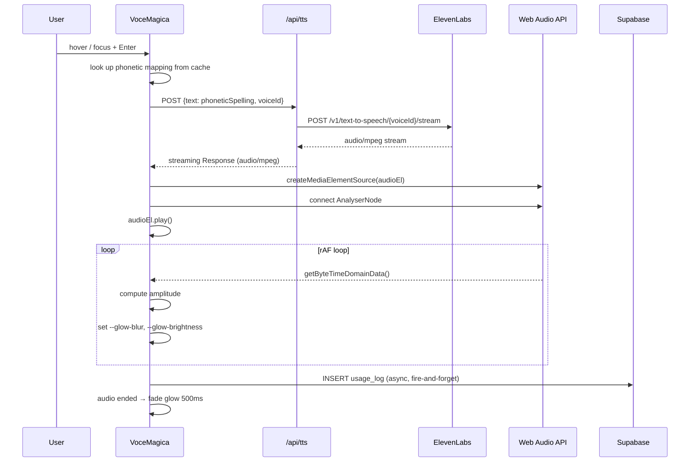

# Design Document: PGM Bornless Ritual

## Overview

The Bornless Ritual is a Next.js 14 (App Router) web application that digitally reconstructs PGM V. 96-172 — the Stele of Jeu the Hieroglyphist from the Greek Magical Papyri. The application combines three experiential layers:

1. **Visual**: A full-viewport CSS-procedural papyrus texture renders the ancient writing surface. Ritual text in Greek/Coptic script is overlaid with typographic distinction for the *voces magicae*.
2. **Auditory**: Hovering or focusing a *vox magica* element triggers a server-proxied ElevenLabs TTS request. The phonetic spelling stored in Supabase is substituted into the request body so the model pronounces the ancient words correctly.
3. **Kinetic**: A `requestAnimationFrame` loop reads real-time amplitude data from a Web Audio API `AnalyserNode` and writes CSS custom properties (`--glow-blur`, `--glow-brightness`) that drive a GPU-composited amber glow on the active text element.

Ritual text sections and phonetic mappings are stored in Supabase and fetched at startup, with hardcoded fallbacks bundled in the app. Usage events are logged to Supabase asynchronously with a single silent retry.

### Key Design Decisions

| Decision | Choice | Rationale |
|---|---|---|
| Framework | Next.js 14 App Router | Server Components for initial data fetch; Route Handlers for API proxy |
| Papyrus texture | CSS-only (gradients + SVG filters) | No image asset dependency; scales perfectly; fully procedural |
| TTS proxy | Next.js Route Handler (`/api/tts`) | Keeps `ELEVENLABS_API_KEY` server-side; enables streaming response |
| Audio analysis | Web Audio API `AnalyserNode` | Native browser API; zero dependencies; real-time amplitude |
| Glow driver | `requestAnimationFrame` + CSS custom properties | GPU-composited; no layout reflow; smooth 60fps |
| Database | Supabase (PostgreSQL) | Managed Postgres; JS SDK; Row Level Security |
| Session ID | `sessionStorage` UUID | Anonymous; no auth required; scoped to tab |

---

## Architecture

### High-Level Component Flow

```mermaid
graph TD
    subgraph Browser
        RP[RitualPage<br/>Server Component]
        RS[RitualSection<br/>Client Component]
        VM[VoceMagica<br/>Client Component]
        AA[useAudioAnalyzer<br/>hook]
        GC[useGlowController<br/>hook]
        WA[Web Audio API<br/>AnalyserNode]
        AU[&lt;audio&gt; element]
    end

    subgraph Next.js Server
        TTS[/api/tts<br/>Route Handler]
        ENV[env validation<br/>startup]
    end

    subgraph Supabase
        RS_TBL[(ritual_sections)]
        PM_TBL[(phonetic_mappings)]
        UL_TBL[(usage_logs)]
    end

    subgraph ElevenLabs
        EL_API[TTS API]
    end

    RP -->|fetch on server| RS_TBL
    RP -->|fetch on server| PM_TBL
    RP --> RS
    RS --> VM
    VM -->|hover/focus| TTS
    TTS -->|proxy + stream| EL_API
    TTS --> AU
    AU --> WA
    WA --> AA
    AA --> GC
    GC -->|CSS custom props| VM
    VM -->|log event| UL_TBL
```

### Request Lifecycle for Audio Playback



---

## Components and Interfaces

### Next.js App Router Structure

```
app/
  layout.tsx              # Root layout: font loading, global CSS
  page.tsx                # RitualPage (Server Component)
  api/
    tts/
      route.ts            # TTS proxy Route Handler
components/
  RitualSection.tsx       # Client Component: renders one ritual section
  VoceMagica.tsx          # Client Component: interactive vox magica element
hooks/
  useAudioAnalyzer.ts     # Web Audio API AnalyserNode management
  useGlowController.ts    # rAF loop → CSS custom property updates
lib/
  supabase/
    client.ts             # Browser Supabase client (singleton)
    server.ts             # Server Supabase client (for Server Components)
  phonetics.ts            # Fallback phonetic mappings (hardcoded)
  ritualText.ts           # Fallback ritual text (hardcoded)
  env.ts                  # Environment variable validation
  session.ts              # sessionStorage UUID management
scripts/
  seed.ts                 # Database seed script
```

### Component Interfaces

#### `RitualPage` (Server Component — `app/page.tsx`)

Fetches `ritual_sections` and `phonetic_mappings` from Supabase on the server. Passes data as props to `RitualSection`. Falls back to bundled content on error.

```typescript
// No props — top-level page
// Returns: JSX with PapyrusBackground + array of RitualSection
```

#### `RitualSection`

```typescript
interface RitualSectionProps {
  section: RitualSection;          // DB row or fallback object
  phoneticMap: PhoneticMap;        // Record<string, string> — original → phonetic
}
```

Renders section heading and body text. Identifies *voces magicae* tokens in the text and wraps each in a `VoceMagica` component.

#### `VoceMagica`

```typescript
interface VoceMagicaProps {
  original: string;        // Display text (e.g. "IAŌ")
  phonetic: string;        // ElevenLabs-compatible spelling (e.g. "ee-ah-oh")
  ariaLabel: string;       // Screen reader pronunciation hint
}
```

Handles:
- `onMouseEnter` / `onFocus` → trigger TTS
- `onMouseLeave` / `onBlur` → cancel pending request
- `onKeyDown` (Enter/Space) → trigger TTS
- CSS custom properties `--glow-blur` and `--glow-brightness` applied via inline style
- `tabIndex={0}`, `role="button"`, `aria-label`

#### `useAudioAnalyzer` hook

```typescript
interface UseAudioAnalyzerReturn {
  analyzerRef: React.RefObject<AnalyserNode | null>;
  connectAudio: (audioElement: HTMLAudioElement) => void;
  disconnectAudio: () => void;
  getAmplitude: () => number;   // Returns normalised 0.0–1.0
}
```

Manages a single `AudioContext` and `AnalyserNode`. `connectAudio` creates a `MediaElementAudioSourceNode` from the provided `<audio>` element and connects it through the analyser to `destination`. `getAmplitude` reads `getByteTimeDomainData` and returns the RMS amplitude normalised to [0, 1].

#### `useGlowController` hook

```typescript
interface UseGlowControllerOptions {
  getAmplitude: () => number;
  elementRef: React.RefObject<HTMLElement | null>;
  isPlaying: boolean;
}

interface UseGlowControllerReturn {
  startGlow: () => void;
  stopGlow: () => void;   // triggers 500ms fade-out
}
```

Runs a `requestAnimationFrame` loop while `isPlaying` is true. On each frame:
1. Calls `getAmplitude()` → value in [0, 1]
2. Computes `blur = amplitude * 24` (px), `brightness = 1 + amplitude * 0.6`
3. Sets `element.style.setProperty('--glow-blur', blur + 'px')`
4. Sets `element.style.setProperty('--glow-brightness', brightness)`

On stop: animates `--glow-blur` and `--glow-brightness` back to `0px` / `1.0` over 500ms using a linear decay per frame.

#### `/api/tts` Route Handler

```typescript
// POST /api/tts
// Request body: { text: string; voiceId: string }
// Response: streaming audio/mpeg

// Server-side only — reads ELEVENLABS_API_KEY from process.env
// Proxies to: https://api.elevenlabs.io/v1/text-to-speech/{voiceId}/stream
// Voice settings: { stability: 0.2, style: 0.9 }
// Returns: ReadableStream piped directly to client
```

Error responses: 400 (missing params), 502 (ElevenLabs error), 500 (unexpected).

---

## Data Models

### Supabase Schema

#### `ritual_sections` table

```sql
CREATE TABLE ritual_sections (
  id          UUID PRIMARY KEY DEFAULT gen_random_uuid(),
  slug        TEXT NOT NULL UNIQUE,   -- e.g. 'opening', 'first_vocal_key'
  title       TEXT NOT NULL,          -- Display title
  body        TEXT NOT NULL,          -- Full section text (Greek/Coptic)
  sort_order  INTEGER NOT NULL,       -- 1–5, determines display sequence
  created_at  TIMESTAMPTZ NOT NULL DEFAULT now()
);
```

Sections (slug → title → sort_order):
- `opening` → "Opening" → 1
- `first_vocal_key` → "First Vocal Key" → 2
- `barbarous_names` → "Barbarous Names" → 3
- `self_identification` → "Self-Identification" → 4
- `final_seal` → "Final Seal" → 5

#### `phonetic_mappings` table

```sql
CREATE TABLE phonetic_mappings (
  id          UUID PRIMARY KEY DEFAULT gen_random_uuid(),
  original    TEXT NOT NULL UNIQUE,   -- e.g. 'IAŌ'
  phonetic    TEXT NOT NULL,          -- e.g. 'ee-ah-oh'
  created_at  TIMESTAMPTZ NOT NULL DEFAULT now()
);
```

Seed data (13 required mappings):

| original | phonetic |
|---|---|
| IAŌ | ee-ah-oh |
| SABAŌTH | sah-bah-oat |
| ADŌNAI | ah-doh-nye |
| ABRASAX | ah-brah-sax |
| ITHYPHALLŌ | ee-thee-fah-loh |
| ARTHEXOUTH | ar-theks-ooth |
| THIAF | thee-af |
| RHEIBET | hray-bet |
| ATHELEBER-SĒTH | ah-theh-leh-ber-seth |
| AŌTH | ah-ote |
| ABRAŌTH | ah-brah-ote |
| BASUM | bah-soom |
| ISAK | ee-sahk |

#### `usage_logs` table

```sql
CREATE TABLE usage_logs (
  id           UUID PRIMARY KEY DEFAULT gen_random_uuid(),
  vox_magica   TEXT NOT NULL,         -- The original string that was triggered
  session_id   UUID NOT NULL,         -- Anonymous session UUID from sessionStorage
  triggered_at TIMESTAMPTZ NOT NULL DEFAULT now()
);

-- Index for analytics queries
CREATE INDEX usage_logs_vox_magica_idx ON usage_logs (vox_magica);
CREATE INDEX usage_logs_session_id_idx ON usage_logs (session_id);
```

### TypeScript Types

```typescript
// lib/types.ts

export interface RitualSection {
  id: string;
  slug: string;
  title: string;
  body: string;
  sort_order: number;
}

export interface PhoneticMapping {
  id: string;
  original: string;
  phonetic: string;
}

// Derived convenience type used throughout the app
export type PhoneticMap = Record<string, string>; // original → phonetic

export interface UsageLog {
  vox_magica: string;
  session_id: string;
  triggered_at: string; // ISO 8601 UTC
}
```

### Papyrus Background — CSS Architecture

The papyrus texture is entirely CSS-procedural. No image assets are required.

```css
/* Layered approach on .papyrus-bg */

.papyrus-bg {
  position: fixed;
  inset: 0;
  z-index: -1;

  /* Base golden-brown */
  background-color: #c8a96e;

  /* Layer 1: Vertical fibrous striations */
  background-image:
    repeating-linear-gradient(
      90deg,
      transparent,
      transparent 2px,
      rgba(139, 90, 43, 0.08) 2px,
      rgba(139, 90, 43, 0.08) 3px
    ),
    /* Layer 2: Horizontal weft striations */
    repeating-linear-gradient(
      0deg,
      transparent,
      transparent 4px,
      rgba(101, 67, 33, 0.05) 4px,
      rgba(101, 67, 33, 0.05) 5px
    ),
    /* Layer 3: Mottled age variation */
    radial-gradient(
      ellipse at 30% 20%,
      rgba(180, 130, 70, 0.4) 0%,
      transparent 60%
    ),
    radial-gradient(
      ellipse at 70% 80%,
      rgba(100, 60, 20, 0.3) 0%,
      transparent 50%
    ),
    radial-gradient(
      ellipse at 50% 50%,
      rgba(210, 170, 100, 0.2) 0%,
      transparent 70%
    );

  /* SVG feTurbulence filter for organic noise */
  filter: url(#papyrus-noise);
}
```

SVG filter (inlined in `layout.tsx` as a hidden `<svg>`):

```svg
<svg style="display:none" aria-hidden="true">
  <defs>
    <filter id="papyrus-noise" x="0%" y="0%" width="100%" height="100%"
            color-interpolation-filters="sRGB">
      <feTurbulence
        type="fractalNoise"
        baseFrequency="0.65 0.35"
        numOctaves="4"
        seed="2"
        result="noise" />
      <feDisplacementMap
        in="SourceGraphic"
        in2="noise"
        scale="4"
        xChannelSelector="R"
        yChannelSelector="G"
        result="displaced" />
      <feColorMatrix
        in="displaced"
        type="saturate"
        values="0.7"
        result="desaturated" />
      <feBlend
        in="desaturated"
        in2="SourceGraphic"
        mode="multiply" />
    </filter>
  </defs>
</svg>
```

The `feDisplacementMap` with `scale="4"` introduces subtle organic warping of the striation lines, breaking the mechanical regularity. `feColorMatrix saturate 0.7` slightly desaturates to simulate aged pigment. The `feBlend multiply` composites the displaced result back over the base, deepening shadows in the striation valleys.

### Glow Animation — CSS Custom Properties

```css
.voce-magica {
  /* Default state */
  --glow-blur: 0px;
  --glow-brightness: 1;

  filter:
    drop-shadow(0 0 var(--glow-blur) hsl(40, 90%, 55%))
    brightness(var(--glow-brightness));

  /* GPU compositing hint */
  will-change: filter;
  transition: filter 0ms; /* rAF drives updates; no CSS transition during play */
}

.voce-magica[data-fading="true"] {
  transition: filter 500ms ease-out;
  --glow-blur: 0px;
  --glow-brightness: 1;
}
```

The `hsl(40, 90%, 55%)` amber/gold sits at hue 40°, within the required 30°–50° range.

### Session Management

```typescript
// lib/session.ts
import { v4 as uuidv4 } from 'uuid';

const SESSION_KEY = 'bornless_session_id';

export function getSessionId(): string {
  if (typeof window === 'undefined') return '';
  let id = sessionStorage.getItem(SESSION_KEY);
  if (!id) {
    id = uuidv4();
    sessionStorage.setItem(SESSION_KEY, id);
  }
  return id;
}
```

### Environment Validation

```typescript
// lib/env.ts
const required = [
  'ELEVENLABS_API_KEY',
  'NEXT_PUBLIC_SUPABASE_URL',
  'NEXT_PUBLIC_SUPABASE_ANON_KEY',
] as const;

export function validateEnv(): void {
  const missing = required.filter(key => !process.env[key]);
  if (missing.length > 0) {
    throw new Error(
      `Missing required environment variables: ${missing.join(', ')}\n` +
      `See .env.example for required configuration.`
    );
  }
}
```

Called at the top of `app/layout.tsx` (server-side execution) and inside the `/api/tts` Route Handler.

---

## Correctness Properties

*A property is a characteristic or behavior that should hold true across all valid executions of a system — essentially, a formal statement about what the system should do. Properties serve as the bridge between human-readable specifications and machine-verifiable correctness guarantees.*


### Property 1: Ritual sections always sort to canonical order

*For any* permutation of the five ritual section records, the sort function applied to them SHALL produce the sequence ordered by `sort_order` 1 → 2 → 3 → 4 → 5 (Opening, First Vocal Key, Barbarous Names, Self-Identification, Final Seal).

**Validates: Requirements 2.1**

---

### Property 2: Phonetic mapping records are structurally complete

*For any* `PhoneticMapping` record returned by Supabase or present in the fallback set, the record SHALL have a non-empty `id`, a non-empty `original` string, and a non-empty `phonetic` string.

**Validates: Requirements 3.1**

---

### Property 3: TTS request body always contains phonetic spelling, never the original

*For any* `(original, phonetic)` pair present in the phonetic map, when a TTS request is initiated for that vox magica, the request body sent to `/api/tts` SHALL contain the `phonetic` value as the `text` field and SHALL NOT contain the `original` string as the `text` field.

**Validates: Requirements 4.1, 4.7**

---

### Property 4: At most one concurrent TTS request per element

*For any* `VoceMagica` element and any sequence of rapid hover/focus events on that element, the number of in-flight TTS requests for that element at any point in time SHALL be at most 1.

**Validates: Requirements 4.3**

---

### Property 5: Glow state resets to defaults after playback ends

*For any* `VoceMagica` element that has completed audio playback, after the 500ms fade transition, the element's `--glow-blur` CSS custom property SHALL equal `0px` and `--glow-brightness` SHALL equal `1`.

**Validates: Requirements 4.5, 5.6**

---

### Property 6: Glow values are proportional to amplitude

*For any* amplitude value `a` in the range [0.0, 1.0], the `useGlowController` hook SHALL compute `--glow-blur = a × 24` (px) and `--glow-brightness = 1 + a × 0.6`. In particular: at `a = 1.0`, blur ≥ 16px and brightness ≥ 1.5; at `a = 0.0`, blur = 0px and brightness = 1.0.

**Validates: Requirements 5.2, 5.4, 5.5**

---

### Property 7: Usage log records contain all required fields

*For any* `(vox_magica, session_id)` pair that triggers a successful audio playback, the `UsageLog` record inserted into Supabase SHALL contain a non-empty `vox_magica` string equal to the triggered original string, a valid ISO 8601 UTC `triggered_at` timestamp, and a non-empty `session_id` equal to the session UUID.

**Validates: Requirements 6.1**

---

### Property 8: Session ID is always a valid UUID v4

*For any* call to `getSessionId()` within a browser session, the returned value SHALL match the UUID v4 format (`xxxxxxxx-xxxx-4xxx-yxxx-xxxxxxxxxxxx`). Repeated calls within the same session SHALL return the same UUID.

**Validates: Requirements 6.2**

---

### Property 9: Seed script execution is idempotent

*For any* number of executions of the seed script ≥ 1, the resulting count of rows in `ritual_sections` SHALL equal 5 and the resulting count of rows in `phonetic_mappings` SHALL equal 13 (no duplicates created by re-runs).

**Validates: Requirements 7.3**

---

### Property 10: Every VoceMagica element is keyboard-accessible

*For any* `VoceMagica` element rendered with any `(original, phonetic)` pair, the rendered DOM element SHALL have `tabIndex={0}`, enabling Tab-key focus.

**Validates: Requirements 8.1**

---

### Property 11: Keyboard interaction is behaviourally equivalent to hover

*For any* `VoceMagica` element, (a) the CSS state applied on keyboard focus SHALL be identical to the state applied on pointer hover, and (b) the TTS request initiated by an Enter or Space keypress SHALL be identical in body and parameters to the request initiated by a `mouseenter` event on the same element.

**Validates: Requirements 8.2, 8.3**

---

### Property 12: aria-label always equals the phonetic spelling

*For any* `VoceMagica` element rendered with phonetic value `p`, the element's `aria-label` attribute SHALL equal `p`.

**Validates: Requirements 8.4**

---

### Property 13: Environment validation error names every missing variable

*For any* non-empty subset of `{ELEVENLABS_API_KEY, NEXT_PUBLIC_SUPABASE_URL, NEXT_PUBLIC_SUPABASE_ANON_KEY}` that is absent from the environment, `validateEnv()` SHALL throw an error whose message contains the exact name of each absent variable.

**Validates: Requirements 9.5**

---

## Error Handling

### Supabase Failures

| Failure point | Behaviour |
|---|---|
| `ritual_sections` fetch fails | Use `lib/ritualText.ts` fallback; log error to console |
| `phonetic_mappings` fetch fails | Use `lib/phonetics.ts` fallback; show non-blocking warning badge |
| `usage_logs` insert fails | Silent retry after 2s; discard on second failure; log to console |

All Supabase calls are wrapped in `try/catch`. Server Component data fetches use `try/catch` around the Supabase call and return fallback data. Client-side inserts use a fire-and-forget async function with the retry logic described in Requirement 6.3–6.4.

### ElevenLabs / TTS Failures

| Failure point | Behaviour |
|---|---|
| `/api/tts` returns 4xx/5xx | Show toast notification; do not interrupt text display |
| Network timeout | AbortController cancels after 10s; show toast |
| Hover-leave before response | AbortController cancels immediately; no toast |

The `VoceMagica` component holds an `AbortController` ref. On `mouseenter`/`focus`, a new controller is created. On `mouseleave`/`blur` (before playback starts), `controller.abort()` is called. The fetch in the component checks for `AbortError` and swallows it silently.

### Environment Validation

`validateEnv()` is called at module load time in `lib/env.ts` and imported by both `app/layout.tsx` (server) and `app/api/tts/route.ts`. A missing variable throws synchronously, causing Next.js to fail fast at startup with a descriptive message rather than a cryptic runtime error.

### Audio Context Lifecycle

The `AudioContext` is created lazily on first user interaction (required by browser autoplay policy). If `AudioContext` creation fails (e.g., browser restriction), the `useAudioAnalyzer` hook catches the error, logs it, and returns a `getAmplitude` function that always returns 0 — audio still plays but without the glow animation.

---

## Testing Strategy

### Property-Based Testing Library

**[fast-check](https://github.com/dubzzz/fast-check)** (TypeScript-native, zero runtime dependencies, excellent Next.js/Jest/Vitest compatibility).

Each property test runs a minimum of **100 iterations** (`numRuns: 100`).

Tag format for each test: `// Feature: pgm-bornless-ritual, Property {N}: {property_text}`

### Unit Tests (Example-Based)

Focused on specific scenarios, error conditions, and integration points:

- `lib/env.ts`: `validateEnv()` throws with correct message for each missing variable combination (covered by Property 13 PBT, plus example for the happy path)
- `lib/session.ts`: returns same UUID on repeated calls; generates new UUID in fresh session
- `lib/phonetics.ts`: fallback map contains all 13 required keys (Requirement 3.2)
- `components/VoceMagica.tsx`: hover triggers fetch; leave before response calls `abort()`; API error shows toast; voice settings are `{stability: 0.2, style: 0.9}`
- `hooks/useGlowController.ts`: `stopGlow()` sets `data-fading="true"` and resets custom properties
- `hooks/useAudioAnalyzer.ts`: `connectAudio()` creates `MediaElementAudioSourceNode` and connects to analyser
- `scripts/seed.ts`: seed arrays contain exactly 5 sections and 13 mappings
- Contrast ratio: text color `#2a1a0a` on background `#c8a96e` computes ≥ 4.5:1

### Property-Based Tests

| Property | Arbitraries | Assertion |
|---|---|---|
| P1: Section sort order | `fc.shuffledSubarray(allFiveSections, {minLength: 5, maxLength: 5})` | sorted result matches canonical order |
| P2: Phonetic mapping completeness | `fc.record({id: fc.uuid(), original: fc.string({minLength:1}), phonetic: fc.string({minLength:1})})` | all fields non-empty |
| P3: TTS uses phonetic spelling | `fc.constantFrom(...Object.entries(phoneticMap))` | request body `.text` equals phonetic, not original |
| P4: No duplicate concurrent requests | `fc.array(fc.constant('hover'), {minLength: 2, maxLength: 10})` | in-flight count never exceeds 1 |
| P5: Glow resets after playback | `fc.constantFrom(...allVoceMagicaElements)` | custom props = 0px / 1 after fade |
| P6: Amplitude proportionality | `fc.float({min: 0, max: 1})` | blur = a×24, brightness = 1+a×0.6 |
| P7: Usage log completeness | `fc.record({vox: fc.string({minLength:1}), session: fc.uuid()})` | inserted record has all fields |
| P8: Session UUID format | `fc.constant(null)` (no input needed) | matches UUID v4 regex |
| P9: Seed idempotence | `fc.integer({min: 1, max: 5})` (run count) | row counts = 5 and 13 |
| P10: tabIndex on all elements | `fc.record({original: fc.string({minLength:1}), phonetic: fc.string({minLength:1})})` | rendered element has tabIndex=0 |
| P11: Keyboard parity | `fc.record({original: fc.string({minLength:1}), phonetic: fc.string({minLength:1})})` | focus state = hover state; keyboard TTS request = hover TTS request |
| P12: aria-label = phonetic | `fc.record({original: fc.string({minLength:1}), phonetic: fc.string({minLength:1})})` | aria-label === phonetic |
| P13: Env validation names missing vars | `fc.subarray(['ELEVENLABS_API_KEY','NEXT_PUBLIC_SUPABASE_URL','NEXT_PUBLIC_SUPABASE_ANON_KEY'], {minLength:1})` | error message contains each missing name |

### Integration Tests

- Supabase: verify `ritual_sections` and `phonetic_mappings` tables are readable after seeding (1–2 examples)
- `/api/tts` Route Handler: verify it proxies to ElevenLabs and returns `audio/mpeg` content-type (1 example with mocked ElevenLabs)
- Full page render: verify fallback content is displayed when Supabase is unreachable

### Visual / Smoke Tests

- Papyrus background renders at 320px, 1280px, 2560px viewport widths (visual regression)
- Focus indicator is visible on `VoceMagica` elements (manual / axe-core)
- Font renders Greek/Coptic characters correctly (visual regression)
- `npm run seed` executes without error against a test Supabase instance
